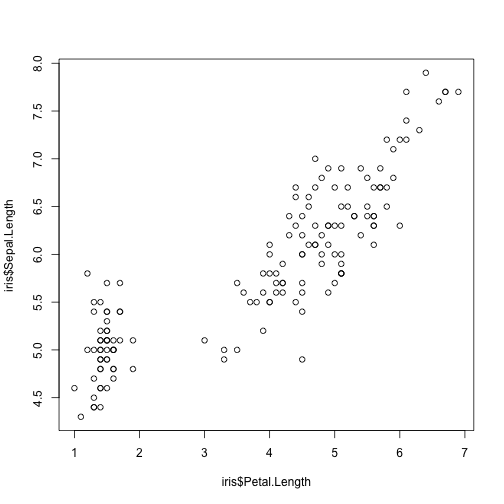

Lesson 3: Data frame, packages, intro to tidyverse
========================================================
author: Mate Csaba Sandor
date: 2018 September
autosize: true

Data frame - Creation
========================================================


```r
a <- data.frame(name = c("Adam", "Eve"),
           sex = c("male", "female"))
a
```

```
  name    sex
1 Adam   male
2  Eve female
```

```r
typeof(a)
```

```
[1] "list"
```

Data frame - Built-ins
========================================================


```r
mtcars
```

```
                     mpg cyl  disp  hp drat    wt  qsec vs am gear carb
Mazda RX4           21.0   6 160.0 110 3.90 2.620 16.46  0  1    4    4
Mazda RX4 Wag       21.0   6 160.0 110 3.90 2.875 17.02  0  1    4    4
Datsun 710          22.8   4 108.0  93 3.85 2.320 18.61  1  1    4    1
Hornet 4 Drive      21.4   6 258.0 110 3.08 3.215 19.44  1  0    3    1
Hornet Sportabout   18.7   8 360.0 175 3.15 3.440 17.02  0  0    3    2
Valiant             18.1   6 225.0 105 2.76 3.460 20.22  1  0    3    1
Duster 360          14.3   8 360.0 245 3.21 3.570 15.84  0  0    3    4
Merc 240D           24.4   4 146.7  62 3.69 3.190 20.00  1  0    4    2
Merc 230            22.8   4 140.8  95 3.92 3.150 22.90  1  0    4    2
Merc 280            19.2   6 167.6 123 3.92 3.440 18.30  1  0    4    4
Merc 280C           17.8   6 167.6 123 3.92 3.440 18.90  1  0    4    4
Merc 450SE          16.4   8 275.8 180 3.07 4.070 17.40  0  0    3    3
Merc 450SL          17.3   8 275.8 180 3.07 3.730 17.60  0  0    3    3
Merc 450SLC         15.2   8 275.8 180 3.07 3.780 18.00  0  0    3    3
Cadillac Fleetwood  10.4   8 472.0 205 2.93 5.250 17.98  0  0    3    4
Lincoln Continental 10.4   8 460.0 215 3.00 5.424 17.82  0  0    3    4
Chrysler Imperial   14.7   8 440.0 230 3.23 5.345 17.42  0  0    3    4
Fiat 128            32.4   4  78.7  66 4.08 2.200 19.47  1  1    4    1
Honda Civic         30.4   4  75.7  52 4.93 1.615 18.52  1  1    4    2
Toyota Corolla      33.9   4  71.1  65 4.22 1.835 19.90  1  1    4    1
Toyota Corona       21.5   4 120.1  97 3.70 2.465 20.01  1  0    3    1
Dodge Challenger    15.5   8 318.0 150 2.76 3.520 16.87  0  0    3    2
AMC Javelin         15.2   8 304.0 150 3.15 3.435 17.30  0  0    3    2
Camaro Z28          13.3   8 350.0 245 3.73 3.840 15.41  0  0    3    4
Pontiac Firebird    19.2   8 400.0 175 3.08 3.845 17.05  0  0    3    2
Fiat X1-9           27.3   4  79.0  66 4.08 1.935 18.90  1  1    4    1
Porsche 914-2       26.0   4 120.3  91 4.43 2.140 16.70  0  1    5    2
Lotus Europa        30.4   4  95.1 113 3.77 1.513 16.90  1  1    5    2
Ford Pantera L      15.8   8 351.0 264 4.22 3.170 14.50  0  1    5    4
Ferrari Dino        19.7   6 145.0 175 3.62 2.770 15.50  0  1    5    6
Maserati Bora       15.0   8 301.0 335 3.54 3.570 14.60  0  1    5    8
Volvo 142E          21.4   4 121.0 109 4.11 2.780 18.60  1  1    4    2
```

Data frame - Addressing
========================================================


```r
mtcars[1,1]
```

```
[1] 21
```

```r
mtcars$mpg
```

```
 [1] 21.0 21.0 22.8 21.4 18.7 18.1 14.3 24.4 22.8 19.2 17.8 16.4 17.3 15.2
[15] 10.4 10.4 14.7 32.4 30.4 33.9 21.5 15.5 15.2 13.3 19.2 27.3 26.0 30.4
[29] 15.8 19.7 15.0 21.4
```

```r
mtcars[[1]]
```

```
 [1] 21.0 21.0 22.8 21.4 18.7 18.1 14.3 24.4 22.8 19.2 17.8 16.4 17.3 15.2
[15] 10.4 10.4 14.7 32.4 30.4 33.9 21.5 15.5 15.2 13.3 19.2 27.3 26.0 30.4
[29] 15.8 19.7 15.0 21.4
```

```r
mtcars$mpg[1]
```

```
[1] 21
```

Data frame - Filtering (!)
========================================================


```r
mtcars[(mtcars$gear > 3) & (mtcars$cyl < 6),]
```

```
                mpg cyl  disp  hp drat    wt  qsec vs am gear carb
Datsun 710     22.8   4 108.0  93 3.85 2.320 18.61  1  1    4    1
Merc 240D      24.4   4 146.7  62 3.69 3.190 20.00  1  0    4    2
Merc 230       22.8   4 140.8  95 3.92 3.150 22.90  1  0    4    2
Fiat 128       32.4   4  78.7  66 4.08 2.200 19.47  1  1    4    1
Honda Civic    30.4   4  75.7  52 4.93 1.615 18.52  1  1    4    2
Toyota Corolla 33.9   4  71.1  65 4.22 1.835 19.90  1  1    4    1
Fiat X1-9      27.3   4  79.0  66 4.08 1.935 18.90  1  1    4    1
Porsche 914-2  26.0   4 120.3  91 4.43 2.140 16.70  0  1    5    2
Lotus Europa   30.4   4  95.1 113 3.77 1.513 16.90  1  1    5    2
Volvo 142E     21.4   4 121.0 109 4.11 2.780 18.60  1  1    4    2
```

Data frame - Functions I
========================================================


```r
summary(mtcars)
```

```
      mpg             cyl             disp             hp       
 Min.   :10.40   Min.   :4.000   Min.   : 71.1   Min.   : 52.0  
 1st Qu.:15.43   1st Qu.:4.000   1st Qu.:120.8   1st Qu.: 96.5  
 Median :19.20   Median :6.000   Median :196.3   Median :123.0  
 Mean   :20.09   Mean   :6.188   Mean   :230.7   Mean   :146.7  
 3rd Qu.:22.80   3rd Qu.:8.000   3rd Qu.:326.0   3rd Qu.:180.0  
 Max.   :33.90   Max.   :8.000   Max.   :472.0   Max.   :335.0  
      drat             wt             qsec             vs        
 Min.   :2.760   Min.   :1.513   Min.   :14.50   Min.   :0.0000  
 1st Qu.:3.080   1st Qu.:2.581   1st Qu.:16.89   1st Qu.:0.0000  
 Median :3.695   Median :3.325   Median :17.71   Median :0.0000  
 Mean   :3.597   Mean   :3.217   Mean   :17.85   Mean   :0.4375  
 3rd Qu.:3.920   3rd Qu.:3.610   3rd Qu.:18.90   3rd Qu.:1.0000  
 Max.   :4.930   Max.   :5.424   Max.   :22.90   Max.   :1.0000  
       am              gear            carb      
 Min.   :0.0000   Min.   :3.000   Min.   :1.000  
 1st Qu.:0.0000   1st Qu.:3.000   1st Qu.:2.000  
 Median :0.0000   Median :4.000   Median :2.000  
 Mean   :0.4062   Mean   :3.688   Mean   :2.812  
 3rd Qu.:1.0000   3rd Qu.:4.000   3rd Qu.:4.000  
 Max.   :1.0000   Max.   :5.000   Max.   :8.000  
```

```r
rbind(mtcars[1:2,],mtcars[5:12,])
```

```
                   mpg cyl  disp  hp drat    wt  qsec vs am gear carb
Mazda RX4         21.0   6 160.0 110 3.90 2.620 16.46  0  1    4    4
Mazda RX4 Wag     21.0   6 160.0 110 3.90 2.875 17.02  0  1    4    4
Hornet Sportabout 18.7   8 360.0 175 3.15 3.440 17.02  0  0    3    2
Valiant           18.1   6 225.0 105 2.76 3.460 20.22  1  0    3    1
Duster 360        14.3   8 360.0 245 3.21 3.570 15.84  0  0    3    4
Merc 240D         24.4   4 146.7  62 3.69 3.190 20.00  1  0    4    2
Merc 230          22.8   4 140.8  95 3.92 3.150 22.90  1  0    4    2
Merc 280          19.2   6 167.6 123 3.92 3.440 18.30  1  0    4    4
Merc 280C         17.8   6 167.6 123 3.92 3.440 18.90  1  0    4    4
Merc 450SE        16.4   8 275.8 180 3.07 4.070 17.40  0  0    3    3
```

Data frame - Functions II
========================================================


```r
apply(iris[,1:4],2,function(x) mean(x))
```

```
Sepal.Length  Sepal.Width Petal.Length  Petal.Width 
    5.843333     3.057333     3.758000     1.199333 
```

```r
head(apply(mtcars,1,function(x) x[1] * x[6]))
```

```
        Mazda RX4     Mazda RX4 Wag        Datsun 710    Hornet 4 Drive 
           55.020            60.375            52.896            68.801 
Hornet Sportabout           Valiant 
           64.328            62.626 
```

Data frame - Functions III
========================================================


```r
myModel <- lm(formula = "Sepal.Length ~ Petal.Length", data = iris)
summary(myModel)
```

```

Call:
lm(formula = "Sepal.Length ~ Petal.Length", data = iris)

Residuals:
     Min       1Q   Median       3Q      Max 
-1.24675 -0.29657 -0.01515  0.27676  1.00269 

Coefficients:
             Estimate Std. Error t value Pr(>|t|)    
(Intercept)   4.30660    0.07839   54.94   <2e-16 ***
Petal.Length  0.40892    0.01889   21.65   <2e-16 ***
---
Signif. codes:  0 '***' 0.001 '**' 0.01 '*' 0.05 '.' 0.1 ' ' 1

Residual standard error: 0.4071 on 148 degrees of freedom
Multiple R-squared:   0.76,	Adjusted R-squared:  0.7583 
F-statistic: 468.6 on 1 and 148 DF,  p-value: < 2.2e-16
```

```r
plot(iris$Petal.Length, iris$Sepal.Length)
```


Data frame - Functions III cont.
========================================================


```r
plot(iris$Petal.Length, iris$Sepal.Length)
abline(lm(formula = "Sepal.Length ~ Petal.Length", data = iris))
```



Data frame - Factors I
========================================================


```r
head(iris)
```

```
  Sepal.Length Sepal.Width Petal.Length Petal.Width Species
1          5.1         3.5          1.4         0.2  setosa
2          4.9         3.0          1.4         0.2  setosa
3          4.7         3.2          1.3         0.2  setosa
4          4.6         3.1          1.5         0.2  setosa
5          5.0         3.6          1.4         0.2  setosa
6          5.4         3.9          1.7         0.4  setosa
```

```r
str(iris)
```

```
'data.frame':	150 obs. of  5 variables:
 $ Sepal.Length: num  5.1 4.9 4.7 4.6 5 5.4 4.6 5 4.4 4.9 ...
 $ Sepal.Width : num  3.5 3 3.2 3.1 3.6 3.9 3.4 3.4 2.9 3.1 ...
 $ Petal.Length: num  1.4 1.4 1.3 1.5 1.4 1.7 1.4 1.5 1.4 1.5 ...
 $ Petal.Width : num  0.2 0.2 0.2 0.2 0.2 0.4 0.3 0.2 0.2 0.1 ...
 $ Species     : Factor w/ 3 levels "setosa","versicolor",..: 1 1 1 1 1 1 1 1 1 1 ...
```

```r
levels(iris$Species)
```

```
[1] "setosa"     "versicolor" "virginica" 
```

Data frame - Factors II
========================================================


```r
as.numeric(iris$Species)
```

```
  [1] 1 1 1 1 1 1 1 1 1 1 1 1 1 1 1 1 1 1 1 1 1 1 1 1 1 1 1 1 1 1 1 1 1 1 1
 [36] 1 1 1 1 1 1 1 1 1 1 1 1 1 1 1 2 2 2 2 2 2 2 2 2 2 2 2 2 2 2 2 2 2 2 2
 [71] 2 2 2 2 2 2 2 2 2 2 2 2 2 2 2 2 2 2 2 2 2 2 2 2 2 2 2 2 2 2 3 3 3 3 3
[106] 3 3 3 3 3 3 3 3 3 3 3 3 3 3 3 3 3 3 3 3 3 3 3 3 3 3 3 3 3 3 3 3 3 3 3
[141] 3 3 3 3 3 3 3 3 3 3
```

```r
summary(iris)
```

```
  Sepal.Length    Sepal.Width     Petal.Length    Petal.Width   
 Min.   :4.300   Min.   :2.000   Min.   :1.000   Min.   :0.100  
 1st Qu.:5.100   1st Qu.:2.800   1st Qu.:1.600   1st Qu.:0.300  
 Median :5.800   Median :3.000   Median :4.350   Median :1.300  
 Mean   :5.843   Mean   :3.057   Mean   :3.758   Mean   :1.199  
 3rd Qu.:6.400   3rd Qu.:3.300   3rd Qu.:5.100   3rd Qu.:1.800  
 Max.   :7.900   Max.   :4.400   Max.   :6.900   Max.   :2.500  
       Species  
 setosa    :50  
 versicolor:50  
 virginica :50  
                
                
                
```

Data frame - Factors II
========================================================


```r
str(data.frame(name = c("Adam", "Eve", "Steve"), 
               sex = c("Male", "Female", "Male")))
```

```
'data.frame':	3 obs. of  2 variables:
 $ name: Factor w/ 3 levels "Adam","Eve","Steve": 1 2 3
 $ sex : Factor w/ 2 levels "Female","Male": 2 1 2
```

```r
str(data.frame(name = c("Adam", "Eve", "Steve"), 
               sex = c("Male", "Female", "Male"),
               stringsAsFactors = FALSE))
```

```
'data.frame':	3 obs. of  2 variables:
 $ name: chr  "Adam" "Eve" "Steve"
 $ sex : chr  "Male" "Female" "Male"
```
- If you are a type of person who is into factors, try [forcats](https://forcats.tidyverse.org/)

Exercise time!
========================================================

Filter iris for virginica observations, where petal and sepal length is both above average.

Handy things - browser
========================================================

- ```browser()``` can stop your code in runtime, and you can access your variables in the terminal
- heaven for debugging

```r
testFunction <- function(a, b){
  aa <- a ^ 2
  browser()
  aa + b
}
```

Handy things - looking up a function quickly
========================================================

If you type in ```?head``` it will bring up the manual page of the function ```head```.

Handy things - source
========================================================

- Write your functions into a file
- with source(filename) you can make all your functions declared in a different script

Handy things - packages
========================================================

- Packages are premade function libraries that you can load into R
- Most of them are publicly available
- You will use a lot of them

Packages - installing
========================================================

- from CRAN ```install.packages('devtools')```
- from gitHub ```devtools::install_github(hadley/tidyr)``` (after installing devtools)

Packages - installing
========================================================
- You can load all functions into your workspace

```r
tibble::tibble()
```

```
# A tibble: 0 x 0
```

```r
library(tibble)
tibble()
```

```
# A tibble: 0 x 0
```

Packages - tidyverse
========================================================

- A [set of packages](https://www.tidyverse.org/packages/) to make work with datasets easier
- Unified framework to deal with data tables (which are now called tibbles)
- Constantly groomed and updated by and active community

Tidyverse - tibbles
========================================================


```r
tibble(name = c("Adam", "Eve", "Steve"),
           sex = c("male", "female", "male"))
```

```
# A tibble: 3 x 2
  name  sex   
  <chr> <chr> 
1 Adam  male  
2 Eve   female
3 Steve male  
```

```r
as.tibble(iris)
```

```
# A tibble: 150 x 5
   Sepal.Length Sepal.Width Petal.Length Petal.Width Species
          <dbl>       <dbl>        <dbl>       <dbl> <fct>  
 1          5.1         3.5          1.4         0.2 setosa 
 2          4.9         3            1.4         0.2 setosa 
 3          4.7         3.2          1.3         0.2 setosa 
 4          4.6         3.1          1.5         0.2 setosa 
 5          5           3.6          1.4         0.2 setosa 
 6          5.4         3.9          1.7         0.4 setosa 
 7          4.6         3.4          1.4         0.3 setosa 
 8          5           3.4          1.5         0.2 setosa 
 9          4.4         2.9          1.4         0.2 setosa 
10          4.9         3.1          1.5         0.1 setosa 
# ... with 140 more rows
```

Tidyverse - magrittr
========================================================


```r
library(magrittr)
mtcars %>% nrow()
```

```
[1] 32
```

```r
c("a", "b", "c") %>% {setNames(c(1, 2, 3), .)}
```

```
a b c 
1 2 3 
```


Tidyverse - dplyr
========================================================


```r
library(dplyr)
iris %>%
  as.tibble() %>%
  select(Species, Sepal.Length, Sepal.Width) %>%
  mutate(Sepal.Volume = Sepal.Width ^ 2 * pi * Sepal.Length) %>%
  filter(Sepal.Volume > 100) %>%
  arrange(Sepal.Volume)
```

```
# A tibble: 139 x 4
   Species    Sepal.Length Sepal.Width Sepal.Volume
   <fct>             <dbl>       <dbl>        <dbl>
 1 versicolor          5.1         2.5         100.
 2 versicolor          6.3         2.3         105.
 3 versicolor          5.5         2.5         108.
 4 versicolor          5.6         2.5         110.
 5 virginica           5.7         2.5         112.
 6 setosa              4.4         2.9         116.
 7 versicolor          5.5         2.6         117.
 8 versicolor          5.2         2.7         119.
 9 versicolor          5.7         2.6         121.
10 setosa              4.3         3           122.
# ... with 129 more rows
```

Tidyverse - tidyr I
========================================================


```r
library(tidyr)
iris %>%
  as.tibble() %>%
  group_by(Species) %>%
  summarise(mean.Sepal.Length = mean(Sepal.Length), 
            max.Sepal.Width = max(Sepal.Width),
            n.Petal.Length = n_distinct(Petal.Length)) %>%
  ungroup() %>%
  mutate(Species = as.character(Species))
```

```
# A tibble: 3 x 4
  Species    mean.Sepal.Length max.Sepal.Width n.Petal.Length
  <chr>                  <dbl>           <dbl>          <int>
1 setosa                  5.01             4.4              9
2 versicolor              5.94             3.4             19
3 virginica               6.59             3.8             20
```

Tidyverse - tidyr II
========================================================


```r
iris %>%
  as.tibble() %>% 
  gather(key = flower_att, value = measurement,
       Sepal.Length, Sepal.Width, Petal.Length, Petal.Width)
```

```
# A tibble: 600 x 3
   Species flower_att   measurement
   <fct>   <chr>              <dbl>
 1 setosa  Sepal.Length         5.1
 2 setosa  Sepal.Length         4.9
 3 setosa  Sepal.Length         4.7
 4 setosa  Sepal.Length         4.6
 5 setosa  Sepal.Length         5  
 6 setosa  Sepal.Length         5.4
 7 setosa  Sepal.Length         4.6
 8 setosa  Sepal.Length         5  
 9 setosa  Sepal.Length         4.4
10 setosa  Sepal.Length         4.9
# ... with 590 more rows
```


The concept of tidy data
========================================================

- Each variable forms a column.

- Each observation forms a row.

- Each type of observational unit forms a table.

Let's tidy up a messy one!
========================================================


```r
head(esoph)
```

```
  agegp     alcgp    tobgp ncases ncontrols
1 25-34 0-39g/day 0-9g/day      0        40
2 25-34 0-39g/day    10-19      0        10
3 25-34 0-39g/day    20-29      0         6
4 25-34 0-39g/day      30+      0         5
5 25-34     40-79 0-9g/day      0        27
6 25-34     40-79    10-19      0         7
```

```r
str(esoph)
```

```
'data.frame':	88 obs. of  5 variables:
 $ agegp    : Ord.factor w/ 6 levels "25-34"<"35-44"<..: 1 1 1 1 1 1 1 1 1 1 ...
 $ alcgp    : Ord.factor w/ 4 levels "0-39g/day"<"40-79"<..: 1 1 1 1 2 2 2 2 3 3 ...
 $ tobgp    : Ord.factor w/ 4 levels "0-9g/day"<"10-19"<..: 1 2 3 4 1 2 3 4 1 2 ...
 $ ncases   : num  0 0 0 0 0 0 0 0 0 0 ...
 $ ncontrols: num  40 10 6 5 27 7 4 7 2 1 ...
```

Look at the factor levels
========================================================


```r
levels(esoph$agegp)
```

```
[1] "25-34" "35-44" "45-54" "55-64" "65-74" "75+"  
```

```r
levels(esoph$alcgp)
```

```
[1] "0-39g/day" "40-79"     "80-119"    "120+"     
```

```r
levels(esoph$tobgp)
```

```
[1] "0-9g/day" "10-19"    "20-29"    "30+"     
```

Let's format the nasty ones
========================================================

```r
library(stringr)
esoph %>% as.tibble() %>%
  mutate(agegp = str_remove(agegp,"\\+"), 
         alcgp = str_remove(alcgp,"\\+") %>% str_remove("g/day"),
         tobgp = str_remove(tobgp,"\\+") %>% str_remove("g/day"))
```

```
# A tibble: 88 x 5
   agegp alcgp  tobgp ncases ncontrols
   <chr> <chr>  <chr>  <dbl>     <dbl>
 1 25-34 0-39   0-9        0        40
 2 25-34 0-39   10-19      0        10
 3 25-34 0-39   20-29      0         6
 4 25-34 0-39   30         0         5
 5 25-34 40-79  0-9        0        27
 6 25-34 40-79  10-19      0         7
 7 25-34 40-79  20-29      0         4
 8 25-34 40-79  30         0         7
 9 25-34 80-119 0-9        0         2
10 25-34 80-119 10-19      0         1
# ... with 78 more rows
```

Let's segment information
========================================================

```r
esoph %>% as.tibble() %>%
  mutate(agegp = str_remove(agegp,"\\+"), 
         alcgp = str_remove(alcgp,"\\+") %>% str_remove("g/day"),
         tobgp = str_remove(tobgp,"\\+") %>% str_remove("g/day")) %>%
  separate(agegp, c("agegp_min","agegp_max"), extra = "merge") %>%
  separate(alcgp, c("alcgp_min","alcgp_max"), extra = "merge") %>%
  separate(tobgp, c("tobgp_min","tobgp_max"), extra = "merge")
```

```
# A tibble: 88 x 8
   agegp_min agegp_max alcgp_min alcgp_max tobgp_min tobgp_max ncases
   <chr>     <chr>     <chr>     <chr>     <chr>     <chr>      <dbl>
 1 25        34        0         39        0         9              0
 2 25        34        0         39        10        19             0
 3 25        34        0         39        20        29             0
 4 25        34        0         39        30        <NA>           0
 5 25        34        40        79        0         9              0
 6 25        34        40        79        10        19             0
 7 25        34        40        79        20        29             0
 8 25        34        40        79        30        <NA>           0
 9 25        34        80        119       0         9              0
10 25        34        80        119       10        19             0
# ... with 78 more rows, and 1 more variable: ncontrols <dbl>
```

We have a model
========================================================

Cancer probability linearly correlate with (minimum) age; alcohol and tobacco consumption.

Let's form the data to stg useable
========================================================


```r
esoph %>% as.tibble() %>%
  mutate(agegp = str_remove(agegp,"\\+"), 
         alcgp = str_remove(alcgp,"\\+") %>% str_remove("g/day"),
         tobgp = str_remove(tobgp,"\\+") %>% str_remove("g/day")) %>%
  separate(agegp, c("agegp_min","agegp_max"), extra = "merge", convert = TRUE) %>%
  separate(alcgp, c("alcgp_min","alcgp_max"), extra = "merge", convert = TRUE) %>%
  separate(tobgp, c("tobgp_min","tobgp_max"), extra = "merge", convert = TRUE) %>%
  mutate(prob = ncases/ncontrols) %>%
  select(prob, age = agegp_min, alcohol = alcgp_min, tobacco = tobgp_min)
```

```
# A tibble: 88 x 4
    prob   age alcohol tobacco
   <dbl> <int>   <int>   <int>
 1     0    25       0       0
 2     0    25       0      10
 3     0    25       0      20
 4     0    25       0      30
 5     0    25      40       0
 6     0    25      40      10
 7     0    25      40      20
 8     0    25      40      30
 9     0    25      80       0
10     0    25      80      10
# ... with 78 more rows
```

And now the model
========================================================


```r
m <- esoph %>% as.tibble() %>%
  mutate(agegp = str_remove(agegp,"\\+"), 
         alcgp = str_remove(alcgp,"\\+") %>% str_remove("g/day"),
         tobgp = str_remove(tobgp,"\\+") %>% str_remove("g/day")) %>%
  separate(agegp, c("agegp_min","agegp_max"), extra = "merge", convert = TRUE) %>%
  separate(alcgp, c("alcgp_min","alcgp_max"), extra = "merge", convert = TRUE) %>%
  separate(tobgp, c("tobgp_min","tobgp_max"), extra = "merge", convert = TRUE) %>%
  mutate(prob = ncases/ncontrols) %>%
  select(prob, age = agegp_min, alcohol = alcgp_min, tobacco = tobgp_min) %>%
  {lm("prob ~ age + alcohol + tobacco", .)}
summary(m)
```

```

Call:
lm(formula = "prob ~ age + alcohol + tobacco", data = .)

Residuals:
     Min       1Q   Median       3Q      Max 
-0.60571 -0.13109 -0.00011  0.10660  0.67966 

Coefficients:
              Estimate Std. Error t value Pr(>|t|)    
(Intercept) -0.5669905  0.0897029  -6.321 1.20e-08 ***
age          0.0119547  0.0014620   8.177 2.68e-12 ***
alcohol      0.0045041  0.0005362   8.400 9.55e-13 ***
tobacco      0.0047964  0.0021548   2.226   0.0287 *  
---
Signif. codes:  0 '***' 0.001 '**' 0.01 '*' 0.05 '.' 0.1 ' ' 1

Residual standard error: 0.2244 on 84 degrees of freedom
Multiple R-squared:  0.6191,	Adjusted R-squared:  0.6055 
F-statistic: 45.51 on 3 and 84 DF,  p-value: < 2.2e-16
```

Exercise time!
========================================================

Tidy up ```bomregions``` dataset from the library ```DAAG```!
Is there a correlation between sunspot activity, rain and AVt?

Exercises for home
========================================================

- Data.table [exercises](https://www.r-bloggers.com/functions-exercises-vol-2/)
- A long escription about tidy data with a [lot of examples](https://cran.r-project.org/web/packages/tidyr/vignettes/tidy-data.html)

