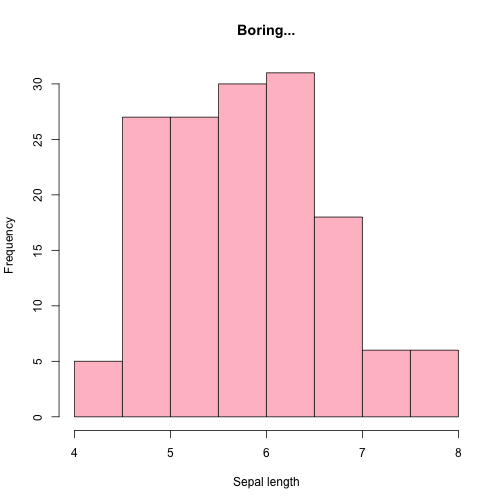

Lesson 4: R Data loading, plots
========================================================
author: Mate Csaba Sandor
date: 2018 September
autosize: true


Reminder about regular expressions
========================================================

- Here is a handy app for [learning regexp in general](https://regexone.com/)
- For R specifics you should check this [cheatsheet](https://www.rstudio.com/wp-content/uploads/2016/09/RegExCheatsheet.pdf)

Data? So basic..
========================================================

- In a firm we usually have a database where we can perform SQL queries
- Now we do not have access to such thins unfortunately
- BUT! Nevertheless, you should learn how to write simple SQL queries 
- [This](https://www.codecademy.com/learn/learn-sql) is a really good 2 hour course that gives you most of what you need to start
- To set up database connections in R you should use `odbc` or `jdbc` packages to set up the connection adn `DBI` to send queries. The responses then are a perfect feed for SQL.

Let's trade Bitcoin! Or not. Whatever.
========================================================

[Here](http://bitcoincharts.com) you can get some sweet exchange datasets, let's download some.

```r
library(readr)
read_csv("http://api.bitcoincharts.com/v1/csv/anxhkUSD.csv.gz") 
```

```
# A tibble: 640,824 x 3
   `1376999407` `100.000000000000` `5.000000000000`
          <int>              <dbl>            <dbl>
 1   1376999726                99              5.5 
 2   1377000070                99              0.05
 3   1377000070               100              0.95
 4   1377000113               100              4   
 5   1377005870               100              1.05
 6   1377019633               103              3.5 
 7   1377042357                99              1.2 
 8   1377042421               102              3   
 9   1377042472                99              2.5 
10   1377101655               102.             1.2 
# ... with 640,814 more rows
```
Hmm. Interesting.

Figuring out the dataset, make it tidy
========================================================


```r
library(magrittr)
readr::read_csv("http://api.bitcoincharts.com/v1/csv/anxhkUSD.csv.gz", col_names = c("date", "volume", "price")) %>%
  dplyr::mutate(date = as.POSIXct(date, origin="1970-01-01"))
```

```
# A tibble: 640,825 x 3
   date                volume price
   <dttm>               <dbl> <dbl>
 1 2013-08-20 13:50:07    100  5   
 2 2013-08-20 13:55:26     99  5.5 
 3 2013-08-20 14:01:10     99  0.05
 4 2013-08-20 14:01:10    100  0.95
 5 2013-08-20 14:01:53    100  4   
 6 2013-08-20 15:37:50    100  1.05
 7 2013-08-20 19:27:13    103  3.5 
 8 2013-08-21 01:45:57     99  1.2 
 9 2013-08-21 01:47:01    102  3   
10 2013-08-21 01:47:52     99  2.5 
# ... with 640,815 more rows
```
And so on...

Questions:
- Which was the most active month?
- What is the bottom 5th percentile of the price returns? (function to use: `lag`)

Exercise time!
========================================================

Yahoo Finance is ususally my first go-to if I need some stock or ETF data.
https://finance.yahoo.com/quote/%5EGSPC/history?p=%5EGSPC

- Download S&P500 full history
- Donwload Dow Jones full history
- Join the second to the first while holding on to all records (see `left_join`, `inner_join` and friends)

We can do excels as well!
========================================================
Download excel file from [here](http://www.cboe.com/micro/buywrite/monthendpricehistory.xls) or jus google "cboe excel download"

```r
readxl::read_excel("monthendpricehistory.xls")
```

```
# A tibble: 417 x 15
   `SPREADSHEET   ~ X__1  X__2  X__3  X__4  X__5  X__6  X__7  X__8  X__9 
   <chr>            <chr> <chr> <chr> <chr> <chr> <chr> <chr> <chr> <chr>
 1 Sources: Bloomb~ Plea~ This~ Data~ "S&P~ Opti~ Past~ <NA>  Supp~ <NA> 
 2 <NA>             www.~ <NA>  www.~ www.~ www.~ www.~ www.~ www.~ www.~
 3 <NA>             Cboe~ S&P ~ "S&P~ Cboe~ Cboe~ Cboe~ "Cbo~ Cboe~ Cboe~
 4 <NA>             BXMSM SPTR  SPX   PUTSM CLL*  BXYSM "VIX~ VXO   BXMD 
 5 31593            92.2~ 239.~ 250.~ 89.9~ 100   n/a   n/a   18.3~ 100  
 6 31624            88.9~ 225.~ 236.~ 88.0~ 95.8~ <NA>  <NA>  19.57 95.5~
 7 31653            92.7~ 242.~ 252.~ 90.3~ 100.~ (scr~ (scr~ 18.5~ 101.~
 8 31685            86.9~ 222.~ 231.~ 86.6~ 93.4~ <NA>  <NA>  24.7~ 94.5 
 9 31716            90.6~ 235.~ 243.~ 89.7~ 97.1~ <NA>  <NA>  19.23 100.~
10 31744            92.4~ 240.~ 249.~ 91.1~ 99.7~ <NA>  <NA>  18.9~ 103.~
# ... with 407 more rows, and 5 more variables: X__10 <chr>, X__11 <chr>,
#   X__12 <chr>, X__13 <chr>, X__14 <chr>
```

Make it nicer...
========================================================
Download excel file from [here](http://www.cboe.com/micro/buywrite/monthendpricehistory.xls) or jus google "cboe excel download"

```r
readxl::read_excel("monthendpricehistory.xls", skip = 4, col_types = c("date",rep("numeric",14))) %>%
  dplyr::rename(date = "X__1", CLL = `CLL*`, VIX = "VIX\u00ae")
```

```
# A tibble: 413 x 15
   date                BXMSM  SPTR   SPX PUTSM   CLL BXYSM   VIX   VXO
   <dttm>              <dbl> <dbl> <dbl> <dbl> <dbl> <dbl> <dbl> <dbl>
 1 1986-06-30 00:00:00  92.2  239.  251.  89.9 100      NA    NA  18.3
 2 1986-07-31 00:00:00  89.0  226.  236.  88.1  95.9    NA    NA  19.6
 3 1986-08-29 00:00:00  92.8  242.  253.  90.4 101.     NA    NA  18.5
 4 1986-09-30 00:00:00  86.9  222.  231.  86.6  93.5    NA    NA  24.8
 5 1986-10-31 00:00:00  90.6  235.  244.  89.8  97.2    NA    NA  19.2
 6 1986-11-28 00:00:00  92.5  241.  249.  91.2  99.7    NA    NA  19.0
 7 1986-12-31 00:00:00  92.1  235.  242.  91.7  97.4    NA    NA  18.7
 8 1987-01-30 00:00:00  96.9  266.  274.  95.2 107.     NA    NA  24.7
 9 1987-02-27 00:00:00  98.3  277.  284.  96.4 108.     NA    NA  22.8
10 1987-03-31 00:00:00 100.   285.  292.  98.2 113.     NA    NA  23.0
# ... with 403 more rows, and 6 more variables: BXMD <dbl>, BFLY <dbl>,
#   CLLZ <dbl>, CMBO <dbl>, CNDR <dbl>, PPUT <dbl>
```

Plotting! The base plots
========================================================

The basic plot function is the most convinient way.

```r
plot(iris)
```


Base plot - with linear models
========================================================


```r
a <- lm(formula = "Sepal.Length ~ Petal.Length", data = iris)
plot(iris$Petal.Length, iris$Sepal.Length)
abline(lm(formula = "Sepal.Length ~ Petal.Length", data = iris))
abline(h = 6)
abline(v = 4)
```


Base plot - density plots
========================================================


```r
hist(iris$Sepal.Length, xlab = "Sepal length", main = "Boring...", col = "pink")
```



Base plot - density plots
========================================================


```r
library(magrittr)
iris$Sepal.Length %>% density() %>% plot(main = "A bit better.", lwd = 4)
iris$Sepal.Length %>% quantile() %>% abline(v = ., col = "red", lwd = 2)
iris$Sepal.Length %>% median() %>% abline(v = ., col = "green", lwd = 8)
```


ggplot for the win!
========================================================


```r
library(ggplot2)
data("midwest", package = "ggplot2")

gg <- ggplot(midwest, aes(x=area, y=poptotal)) + 
  geom_point(aes(col=state, size=popdensity)) + 
  geom_smooth(method="loess", se=F) + 
  xlim(c(0, 0.1)) + 
  ylim(c(0, 500000)) + 
  labs(subtitle="Area Vs Population", 
       y="Population", 
       x="Area", 
       title="Scatterplot", 
       caption = "Source: midwest")

plot(gg)
```


ggplot for the win!
========================================================


zoo and dygraphs
========================================================


```
Error in file(con, "rb") : cannot open the connection
```
